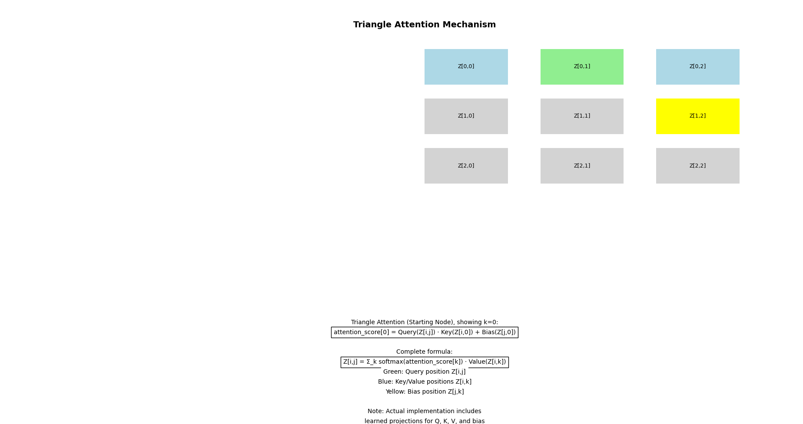
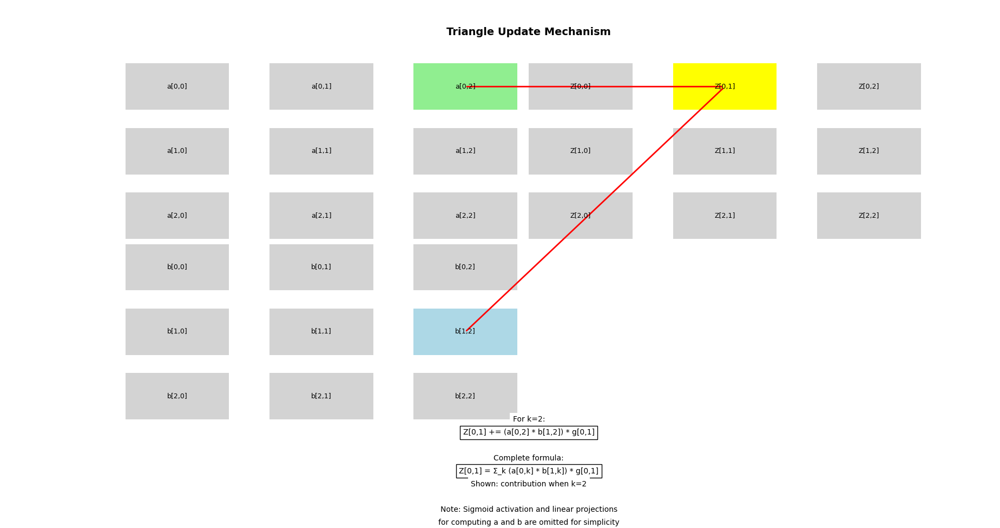

# Pairformer Demo

Implementation of Triangle Attention and Triangle Update mechanisms from the AlphaFold3 Pairformer module.

## Visualizations

### Triangle Attention Mechanism
This visualization shows how the triangle attention mechanism processes relationships between tokens:



Key components shown:
- Green: Query position Z[i,j]
- Blue: Key/Value positions Z[i,k]
- Yellow: Bias position Z[j,k]

### Triangle Update Mechanism
This visualization demonstrates how the triangle update mechanism updates pair representations:



## Installation

```bash
git clone https://github.com/yourusername/pairformer-demo
cd pairformer-demo
pip install -r requirements.txt


## Structure
- \`src/\`: Source code for both mechanisms
- \`examples/\`: Usage examples
- \`docs/\`: Detailed documentation
- \`tests/\`: Unit tests
- \`assets/\`: Visualization outputs

## References
- [The Illustrated AlphaFold](https://elanapearl.github.io/blog/2024/the-illustrated-alphafold/)
- [Pareti - Pairformer Demo](https://docs.google.com/document/d/1GqRcJmi_1tIUjjn22HonvB0AbSd6D_VdAIryUvbJdn8/edit?usp=sharing)
